<!--
**hanna244/hanna244** 저장소를 만들고, `README.md` 파일을 작성하면 GitHub 프로필에 표시됩니다. 프로필을 작성하는데 도움이 되는 몇 가지 작성 예는 다음과 같아요.

참고: https://github.com/anuraghazra/github-readme-stats/blob/master/docs/readme_kr.md

- 🔭 현재 작업 중입니다 ...
- 🌱 나는 현재 배우고 있습니다 ...
- 👯 공동 작업을 찾고 있습니다 ...
- 🤔 도움을 구하고 있습니다 ...
- 💬 저에게 물어보세요 ...
- 📫 연락 방법 : ...
- 😄 대명사 : ...
- ⚡ 재미있는 사실: ...
-->

## Hi there, I'm Hanna &nbsp; 

<!-- 참고: https://shields.io/ -->
<!-- 참고: https://simpleicons.org/ -->

&nbsp; 
&nbsp; 
&nbsp; 

<!-- 테마 참고: https://github.com/anuraghazra/github-readme-stats/blob/master/themes/README.md -->

<!-- 참고: https://getemoji.com/#objects -->

- **1day 1commit**을 실천하려 매일 노력하는 중입니다! 👱🏻‍♀️ 🧁 🍰 🎂
- 2021년의 저는 **좋은 개발자로 성장**할 겁니다. 지켜봐주세요. 👀 🙊
- 코로나19 🦠 로 전 세계가 힘들지만, 모두 힘내서 이겨냈으면 좋겠습니다. 🌹
- 연락은 <shhn0509@gmail.com>로 메일 주세요. ☃️

 

 

## Languages and Tools&nbsp; 

&nbsp; 
&nbsp; 
&nbsp; 
&nbsp; 

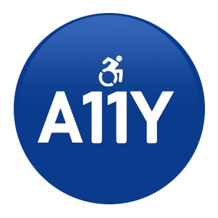

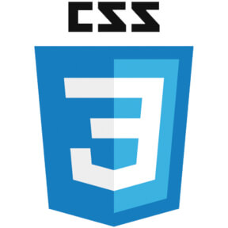
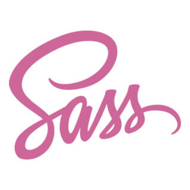
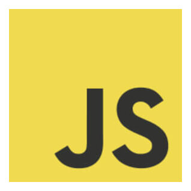
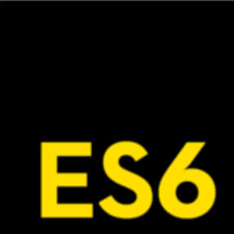
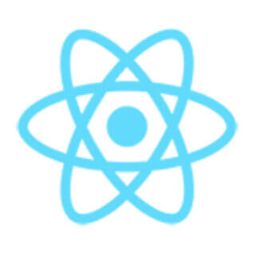
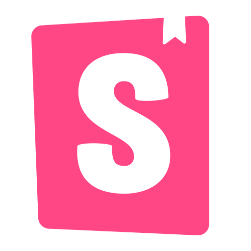
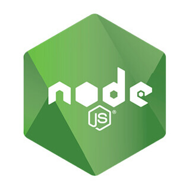
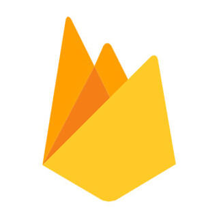
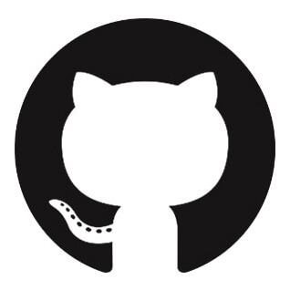

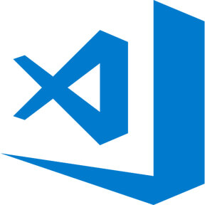
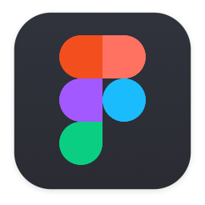

 
 
 

 

<!-- ## Hanna is participating learning repository

**이듬(E.UID) 멘토링 프로그램**에 참여하고 있어요.  
이 저장소에서 저의 TIL 등 공부하는 모습을 볼 수 있습니다! 구경하러 오세요. 열심히 하고 있어요. 😁 📚✏️

   -->

<!-- - **이듬(E.UID) 블렌디드 러닝 2020**에 참여했어요. -->

  <!--  -->

## Hanna is working project repository 

<!-- 참고: https://shields.io/, https://simpleicons.org, https://worldvectorlogo.com -->

**넷플릭스(Netflix) 개선 프로젝트**를 진행하고 있어요. (비공개)

**CSS & Scss 버전**

**React 버전** 

<!-- 왓챠 레이블  -->
<!--  -->

